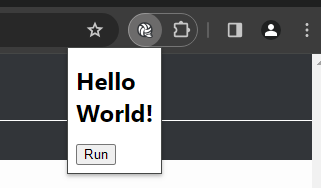

# Hello World - Chrome Extensions



## セットアップ

バージョン ( chrome://settings/help ) :

```text
Chrome は最新の状態です
バージョン: 122.0.6261.112（Official Build） （64 ビット）
```

1. 当リポジトリを clone しておく。

    ```shell
    git clone ...
    ```

2. Chrome の拡張機能設定画面 ( chrome://extensions/ ) を開く。
3. 画面右上部の `デベロッパー モード` を有効化する。
4. 画面上部の `パッケージ化されていない拡張機能を読み込む` をクリックする。
5. clone したリポジトリの `my-extension/` を指定する。
6. 拡張機能が追加される。
7. 拡張機能を起動し、`Hello world!` が表示されれば成功。

※ 拡張機能を更新した場合、設定画面の `更新` をクリックして再読み込みする必要がある。

## メモ

- `Run` ボタンをクリックすると、背景色を変更できる。
    - `manifest.json` でタブへのアクセスとスクリプト実行の権限を与え、`popup.html` から `popup.js` を呼び出している。

        ```json
        // manifest.json
        "manifest_version": 3,
        "permissions": ["activeTab", "scripting"],
        "action": {
            ...
        ```

    - マージコミット: [Merge branch 'ex02/run-scripts' · kenkenpa198/helloworld-chrome-extensions@9d459fc](https://github.com/kenkenpa198/helloworld-chrome-extensions/commit/9d459fcbda993d96ab266e385dd38240ddd03f3f)
- 変更する背景色は、拡張機能を右クリック > `オプション` から変更できる。

    - 権限へストレージを追加し、オプションページへ `options.html` を定義している。

        ```json
        // manifest.json
        "permissions": ["activeTab", "scripting", "storage"],
        "options_page": "options.html",
        "action": {
            ...
        ```

    - マージコミット: [Merge branch 'ex03/add-options' · kenkenpa198/helloworld-chrome-extensions@dcb8eac](https://github.com/kenkenpa198/helloworld-chrome-extensions/commit/dcb8eac758b55d7f32dfe12d1a32461e59d2a5b6)
- アイコンは 16, 32, 48, 128 px 以外のサイズでもよい。
    - [マニフェスト - アイコン  \|  Extensions  \|  Chrome for Developers](https://developer.chrome.com/docs/extensions/reference/manifest/icons?hl=ja)

        > 注: 他のサイズのアイコンを指定できます。その場合、Chrome では必要に応じて最適なサイズが使用されます。

    - マージコミット: [Merge branch 'ex04/unify-icons' · kenkenpa198/helloworld-chrome-extensions@5ae93f1](https://github.com/kenkenpa198/helloworld-chrome-extensions/commit/5ae93f18ff3ba796fe469850d329c6bee7cae2ab)


## 参考文献

- [とほほのChrome拡張機能開発入門 - とほほのWWW入門](https://www.tohoho-web.com/ex/chrome_extension.html)
- [マニフェスト - アイコン  \|  Extensions  \|  Chrome for Developers](https://developer.chrome.com/docs/extensions/reference/manifest/icons?hl=ja)
